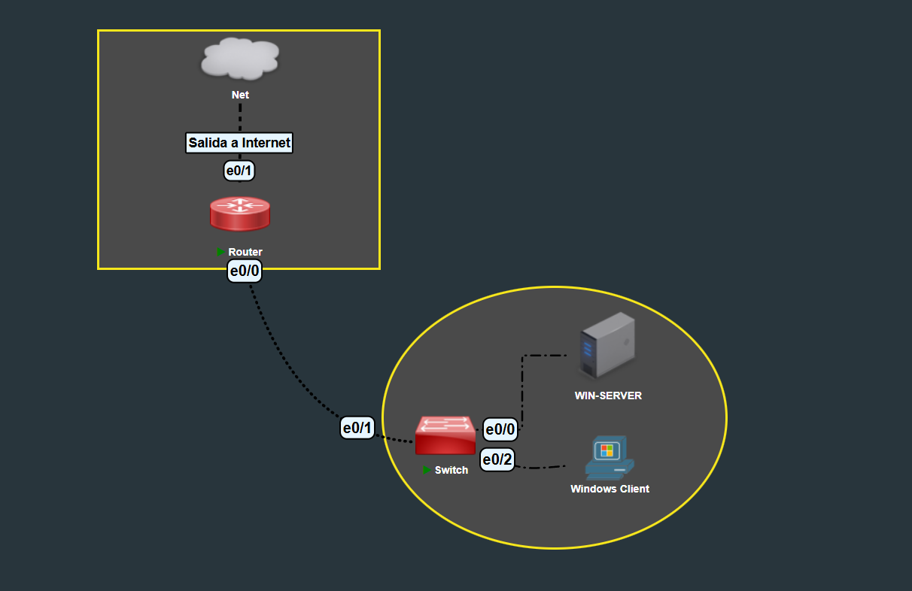
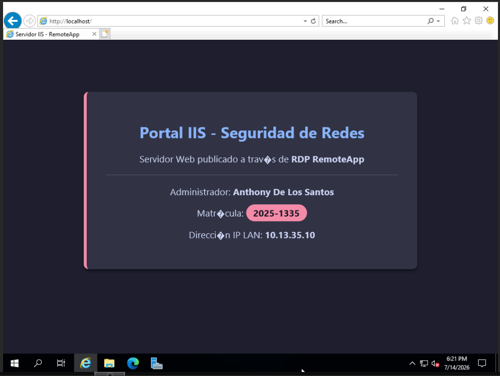
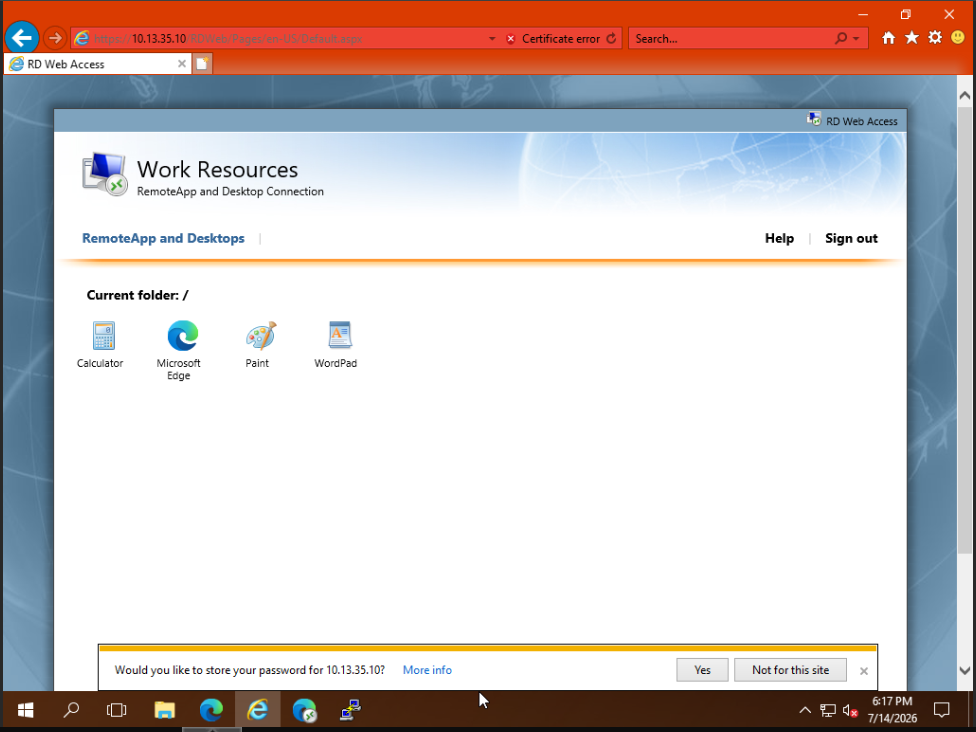
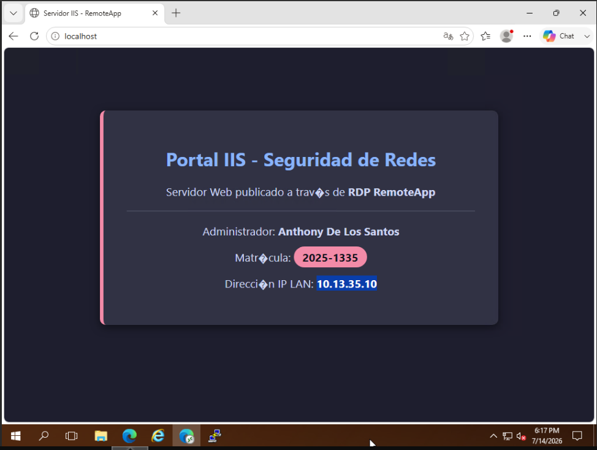
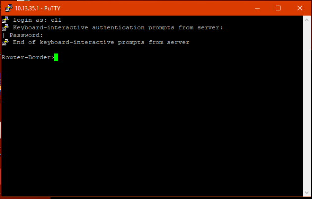
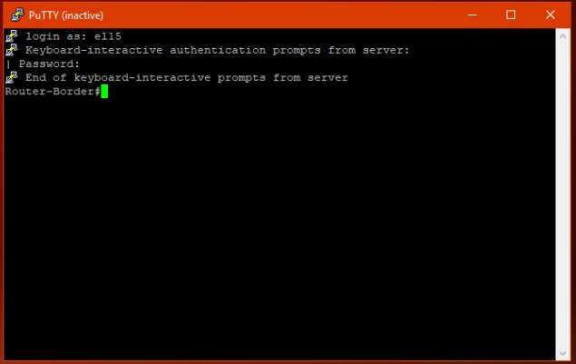
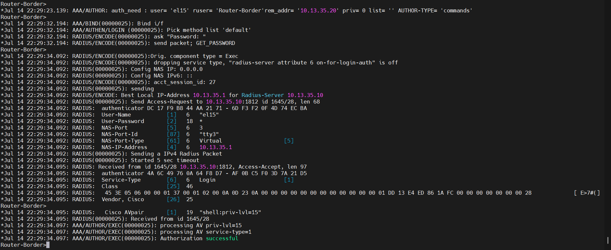

# 🛡️ Infraestructura de Red Centralizada: AAA RADIUS (NPS), RDS RemoteApp e IIS

> **Documentación Técnica de Implementación de Red**  
> **Administrador de Infraestructura:** Anthony De Los Santos  
> **Matrícula:** 2025-1335  
> **Asignatura:** Seguridad de Redes  

---

## 🎥 Demostración en Video del Laboratorio

Para comprobar el funcionamiento en tiempo real de los servicios, el control de acceso y las auditorías en vivo de esta infraestructura, consulta la demostración oficial:

**🎬 Contenido del recorrido operativo:**
* **00:00** - Presentación técnica y arquitectura general.
* **00:50** - Acceso web por **RD Web Access** y ejecución de **RemoteApp** (Navegador publicado).
* **02:35** - Consulta de la Intranet Corporativa (**IIS**) virtualizada.
* **03:22** - Auditoría de control de acceso: Conexión SSH restringida al **Nivel de Privilegio 1** (`el1`).
* **05:40** - Autenticación administrativa: Conexión SSH directa al **Nivel de Privilegio 15** (`el15`).
* **06:10** - Validación de logs en consola del enrutador (**`debug radius` / `debug aaa`**).

---

## 📌 1. Objetivo de la Red y Alcance del Proyecto

El objetivo fundamental de esta arquitectura es diseñar, desplegar y asegurar una infraestructura de red corporativa híbrida basada en la administración centralizada de identidades, el control de acceso basado en roles (**RBAC**) y la virtualización de servicios empresariales.

### Objetivos Específicos:
* **Seguridad Centralizada (Modelo AAA):** Delegar la autenticación, autorización y auditoría del enrutador de borde Cisco hacia un servidor RADIUS local (**Network Policy Server - NPS**) integrado con Active Directory.
* **Segmentación de Privilegios por Rol:** Implementar directivas de red que otorguen acceso administrativo total (**Privilegio 15**) al personal autorizado y acceso restringido de monitoreo (**Privilegio 1**) a los operadores de soporte.
* **Virtualización y Publicación de Servicios (RDS):** Desplegar los Servicios de Escritorio Remoto para encapsular y distribuir el navegador corporativo, permitiendo la consulta segura de la intranet sin exponer el escritorio nativo del servidor.
* **Alta Disponibilidad y Resiliencia:** Configurar traducción de direcciones (**NAT Overload**) para salida a Internet y garantizar el enrutamiento y acceso administrativo de respaldo.

---

## 🗺️ 2. Topología de Red y Esquema de Direccionamiento

La red opera bajo un direccionamiento privado `10.13.35.0/24`, interconectando el enrutador de borde, el servidor perimetral y las estaciones de trabajo del dominio.

*Figura 1: Diagrama lógico y físico de la infraestructura de red del laboratorio.*

### Tabla de Direccionamiento IP y Roles de Red

| Dispositivo / Nodo | Interfaz | Dirección IP | Máscara de Subred | Gateway | Servidor DNS | Rol / Función Principal |
| :--- | :--- | :--- | :--- | :--- | :--- | :--- |
| **Router-Border** | `Ethernet0/0` (LAN) | `10.13.35.1` | `255.255.255.0` | N/A | N/A | Gateway LAN / Cliente RADIUS (NAS) |
| **Router-Border** | `Ethernet0/1` (WAN) | DHCP (Pública) | N/A | ISP | DNS ISP | Salida a Internet / NAT Overload |
| **Windows Server** | `Ethernet` (LAN) | `10.13.35.10` | `255.255.255.0` | `10.13.35.1` | `127.0.0.1` | AD DS / DNS / NPS (RADIUS) / IIS / RDS RemoteApp |
| **Cliente Win10** | `Ethernet` (LAN) | `10.13.35.20` | `255.255.255.0` | `10.13.35.1` | `10.13.35.10` | Estación de Auditoría y Cliente RDP / SSH |

---

## ⚙️ 3. Arquitectura y Configuración de Servicios

### 3.1 Autenticación Centralizada RADIUS (NPS)
Se registraron directivas de acceso en el **Network Policy Server** vinculadas a grupos de seguridad del dominio:
* **Directiva Acceso_15:** Configurada con el atributo específico de proveedor (*Vendor-Specific*) de Cisco `shell:priv-lvl=15` y `Service-Type = Login`. Asigna control total de configuración.
* **Directiva Acceso_1:** Configurada con el atributo `shell:priv-lvl=1` y `Service-Type = Login`. Restringe al usuario al modo EXEC básico.
* **Criptografía de Red:** Habilitación de métodos de autenticación no cifrada **PAP (SPAP)** y **CHAP** para compatibilidad nativa con las consolas SSH virtuales (VTY) de Cisco IOS.

### 3.2 Servicios de Escritorio Remoto (RemoteApp & RD Web Access)
Se implementó la suite **RDS** para publicar aplicaciones de trabajo de forma segura:
* Acceso web al portal de recursos corporativos mediante HTTPS (`/rdweb`).
* Publicación encapsulada del navegador corporativo para el acceso aislado a recursos de la intranet sin exponer el escritorio de Active Directory.

### 3.3 Intranet Corporativa (IIS)
Despliegue del rol **Internet Information Services (IIS)** alojando una página web estática personalizada con los identificadores del administrador de la red, accesible local y remotamente por los puertos estándar HTTP (80) y HTTPS (443).

---

## 📸 4. Capturas de Evidencia y Auditoría Técnica

A continuación, se presentan las validaciones operativas que certifican el funcionamiento al 100% de la infraestructura:

### 🌐 A. Servicios Web y RemoteApp

> **Explicación:** Consulta exitosa del servidor web IIS de forma local en el servidor mostrando la identidad del administrador (Matrícula `2025-1335`).

> **Explicación:** Acceso al portal cliente de **RD Web Access** desde la estación de trabajo Windows 10 con el catálogo de aplicaciones remotas publicadas.

> **Explicación:** Ejecución del navegador corporativo como **RemoteApp**, consultando la intranet de IIS sin otorgar acceso al escritorio nativo del servidor.

### 🔐 B. Control de Acceso por Roles (SSH vía RADIUS)

> **Explicación:** Conexión SSH hacia el enrutador (`10.13.35.1`) autenticada por RADIUS con el usuario `el1`. El sistema asigna el **Privilegio 1** (`>`), impidiendo modificaciones en el equipo.

> **Explicación:** Conexión SSH autenticada con el usuario administrativo `el15`. El servidor NPS inyecta el atributo de autorización, otorgando acceso directo al modo EXEC Privilegiado (**Privilegio 15**, `#`).

### 📊 C. Logs de Auditoría en Tiempo Real (Router Cisco)

> **Explicación:** Trazabilidad en la consola del enrutador mediante los comandos `debug aaa authentication`, `debug aaa authorization` y `debug radius`. Se evidencia la recepción de los paquetes **`Access-Accept`** provenientes del servidor NPS (`10.13.35.10`) y la validación exitosa de las sesiones (`status = PASS`).

---
*Desarrollado como proyecto de la materia Seguridad de Redes - 2026.*